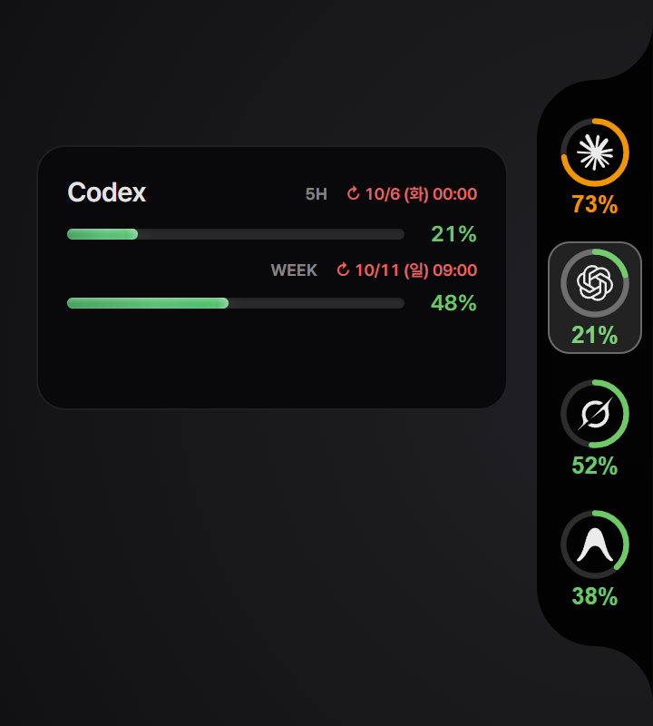
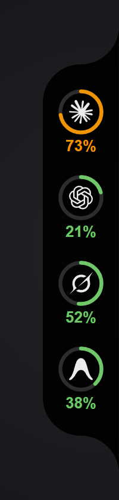
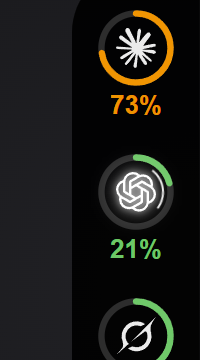
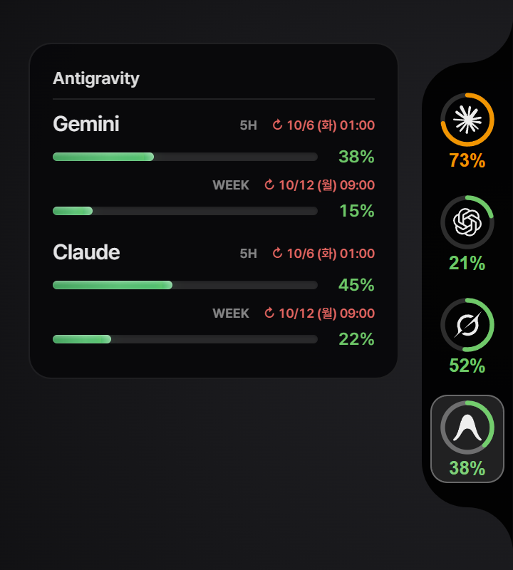
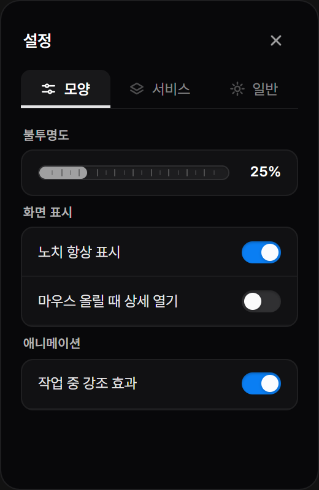
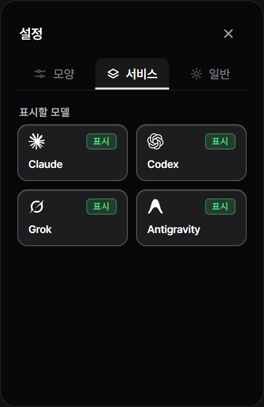
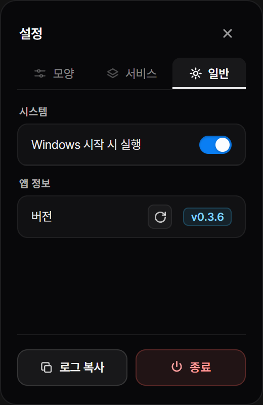

# Token Usage

> **Windows 화면 가장자리에 자연스럽게 붙는 AI 코딩 쿼터 & 리필 카운트다운 모니터**

<p align="center">
  <a href="https://github.com/sky64422/TokenUsage/releases/latest">
    
  </a>
</p>

<p align="center">
  
</p>

---

## 핵심 기능 (Features)

### 1. 화면 에지 노치 & 작업 중 표시
평소엔 화면 가장자리(또는 작업표시줄 위)에 조용히 위치하며, AI 코딩 중엔 궤도가 회전합니다.  
*마우스를 떼면 얇은 탭으로 자동 접히며, 올리면 다시 펼쳐집니다. (항상 고정하려면 설정에서 `노치 항상 표시`를 켜세요)*

| 에지 노치 (평상시) | 모델 작업 중 (Live Activity) |
|:---:|:---:|
|  |  |

---

### 2. 링 클릭 상세 쿼터 창
아이콘을 클릭하면 5시간·주간 쿼터 진행바와 리필 카운트다운(`↻ 3h 12m`)이 펼쳐집니다.

| 단일 / 듀얼 쿼터 (Codex) | 멀티 그룹 쿼터 (Antigravity AGY) |
|:---:|:---:|
|  |  |
| *5시간 롤링 한도 & 주간 쿼터* | *Gemini / Claude 패밀리 분리 표시* |

---

### 3. 3-탭 설정 패널
우클릭 또는 `Shift+F10`으로 불투명도, 서비스 켜기/끄기, 자동 실행을 설정합니다.

| 모양 (Appearance) | 서비스 (Services) | 일반 (General) |
|:---:|:---:|:---:|
|  |  |  |
| *불투명도 · 항상 표시 · 호버 열기* | *사용 중인 AI 서비스만 표시* | *시작 시 실행 · 원클릭 업데이트* |

---

## 조작법 (Controls)

| 조작 | 기능 |
|:---|:---|
| 🖱️ **클릭** | 상세 쿼터 카드 열기 / 닫기 (고정) |
| ✋ **드래그** | 화면 4면 모서리(상·하·좌·우) 및 다른 모니터로 이동 |
| ⚙️ **우클릭** | 설정창 열기 (`Shift+F10`) |
| ⎋ **Esc** | 열린 창 닫기 / 드래그 취소 |
| 📌 **트레이 아이콘** | 작업표시줄 시스템 트레이에서 보이기 / 숨기기 / 종료 |

---

## 지원 서비스 (Zero-Config)

*API 키 입력 불필요 — PC에 1회 이상 로그인된 CLI 세션을 자동 감지합니다.*  
*잔여 한도 메타데이터만 로컬에서 조회하므로 추가 코딩 토큰을 소모하지 않습니다.*

- 🟣 **Claude Code** (`claude`) — 5시간 한도 & 7일 쿼터
- 🟢 **OpenAI Codex CLI** (`codex`) — 5시간 한도 & 주간 쿼터
- ⚪ **xAI Grok CLI** (`grok`) — 주간 크레딧 풀
- 🔵 **Google Antigravity** (`agy`) — Gemini & Claude 쿼터

---

## 빠른 시작 (Quick Start)

- **요구사항:** Windows 10 / 11 (64-bit)
1. **[Releases](https://github.com/sky64422/TokenUsage/releases/latest)**에서 설치 파일(`.exe` / `.msi`) 다운로드
2. 실행 즉시 화면 모서리에 잔여 쿼터 자동 표시

---

<details>
<summary><strong>개발자 가이드 (For Developers)</strong></summary>

```powershell
npm install
npm run tauri dev
npm test
npm run build
```

- 아키텍처: [`docs/ARCHITECTURE.md`](docs/ARCHITECTURE.md) · 프로바이더: [`docs/providers.md`](docs/providers.md) · 디자인: [`DESIGN.md`](DESIGN.md)

</details>

---

## 참고 및 크레딧 (References & Credits)

- **[CodeNotch](https://github.com/vinzdg/codenotch)** — 화면 가장자리에 자연스럽게 밀착되는 에지 노치 디자인과 인터랙션 콘셉트, 그리고 Windows 환경의 Antigravity CLI ConPTY 연동 방식에 많은 영감과 참조를 받았습니다. (MIT License · [`third-party/codenotch/NOTICE.md`](third-party/codenotch/NOTICE.md))

